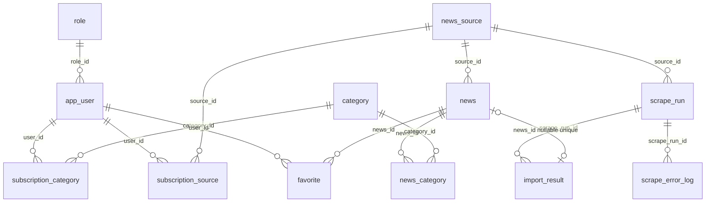

# Фактическая схема PostgreSQL из отчёта

Диаграмма описывает SQL после миграций 001 и 002. Это пояснение текущего
состояния, а не исправленная модель. В частности, SQL разрешает новости без
категорий и без результата импорта, хотя часть текста отчёта требует обратного.

`||` — ровно один, `o{` — от нуля до многих, `o|`/`|o` — от нуля до одного.
Каждая строка таблицы связи ссылается на ровно одного участника с каждой стороны;
это не требует, чтобы у каждого участника существовала хотя бы одна связь.
`news_category` реализует связь M:N, но допускает ноль категорий у новости.

| Связь | Удаление родителя в исходном SQL |
| --- | --- |
| `role → app_user` | RESTRICT — нельзя удалить используемую роль |
| `news_source → news, scrape_run, subscription_source` | CASCADE |
| `news → news_category, favorite` | CASCADE |
| `category → news_category, subscription_category` | CASCADE |
| `app_user → subscription_category, subscription_source, favorite` | CASCADE |
| `scrape_run → import_result, scrape_error_log` | CASCADE |
| `news → import_result.news_id` | SET NULL |

Все 12 таблиц имеют первичные ключи. У восьми основных таблиц — `GENERATED ALWAYS
AS IDENTITY`; у четырёх таблиц связей — составные ключи. Есть 14 внешних ключей,
6 ограничений UNIQUE и 4 CHECK. В PostgreSQL CHECK, UNIQUE, PRIMARY KEY и FK
решают разные задачи; их наличие само по себе не обеспечивает все требования
приложения. [Документация PostgreSQL](https://www.postgresql.org/docs/18/ddl-constraints.html).

В `import_result` UNIQUE на `news_id` разрешает несколько NULL: разные неуспешные
результаты могут не создавать новость. Это нормальное поведение данной связи.
Проблемы — отсутствие зависимости между статусом и наличием новости, а также
отсутствие проверки совпадения источника новости с источником запуска сбора.
